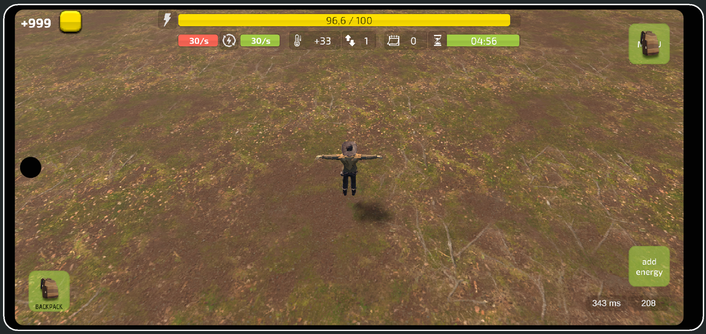

&nbsp;&nbsp;&nbsp;
&nbsp;&nbsp;&nbsp;
&nbsp;&nbsp;&nbsp;

---

    
🟢 Технологии (развернуть)

---

&nbsp;&nbsp;&nbsp;

&nbsp;&nbsp;&nbsp;

&nbsp;&nbsp;&nbsp;

&nbsp;&nbsp;&nbsp;

&nbsp;&nbsp;&nbsp;

&nbsp;&nbsp;&nbsp;

&nbsp;&nbsp;&nbsp;

&nbsp;&nbsp;&nbsp;

---

    
🟢 Опыт (развернуть)

---

&nbsp;&nbsp;&nbsp;

### Участие в инди-команде

*Симулятор с крафтом, тайм-менеджментом, историей.*

 

    
🟢 Примеры выполненных/выполняемых задач

- AI-поведение на UnityBehaviourGraph (патрулирование, обнаружение, преследование, атака)
- Более сложное AI-поведение (взаимодействие с окружением и системами)
- Прототип квестовой системы
- Подключение анимаций, визуальных эффектов
- Верстка интерфейса с UI Toolkit
- и еще много интересных задач в планах.

 

---

&nbsp;&nbsp;&nbsp;

### Пет-проект

*Игра, в которой необходимо найти выход из бункера, решив взаимосвязанные логические задачи. Локализация.*

&nbsp;&nbsp;&nbsp;

 

  
<strong>🟢 Примеры выполненных/выполняемых задач </strong>

- Создание интерфейса с помощью UI Toolkit
- Использование системы сообщений MessagePipe
- Подключение анимаций
- Система взаимодействий с объектами через добавление компонентов-декораторов. (блокирующих, требующих предметы и тд)
- Система глобальных условий, которые влияют на поведение объектов
- Создание эффектов в Unity Visual Effect Graph
- "Диалоговая система" с использованием UniTask
- Оптимизация освещения. Запекание и пробы
- и много еще чего в планах

 

---

&nbsp;&nbsp;&nbsp;

### Прототип

*Прототип, в котором проверял идею для UI с таймерами, анимациями для сурвайвал игры с необходимостью пополнения энергии
для выживания.*

  
<strong>🟢 Скриншот</strong>

 

<strong>🟢 Примеры выполненных/выполняемых задач</strong>

- Создание интерфейса и меню с помощью UI Toolkit
- Анимации на DOTween
- Сохранение данных MessagePack

 

---

&nbsp;&nbsp;&nbsp;

### Пет-проект

*Игра, в которой необходимо уничтожать "волны" врагов.*

&nbsp;&nbsp;&nbsp;
[-FFF?style=social&logo=android&labelColor=FFF)](https://github.com/jrd-prime/Test_Game_I/releases/download/Test-Game-I-ver.1.0.0-final/Test_Game_I_v1.0.0.apk)
&nbsp;&nbsp;&nbsp;

 

<strong>🟢 Примеры выполненных/выполняемых задач</strong>

- Создание интерфейса и меню с помощью UI Toolkit
- Анимации на DOTween

 

---

&nbsp;&nbsp;&nbsp;

### Прототип

*Прототип, в котором изучал технологии.*

&nbsp;&nbsp;&nbsp;

 

<strong>🟢 Примеры выполненных/выполняемых задач</strong>

- Создание интерфейса с помощью UI Toolkit
- Анимации на DOTween
- Взаимодействия с условиями

 

---

&nbsp;&nbsp;&nbsp;

### Изучение, применение и участие в инди-командах

- *Изучал Unity DOTS, ECS Native и другие технологии*
- *Создавал мелкие прототипы используя изучаемые технологии*
- *Участвовал в 2 очень мелких начинающих инди-командах*

---
